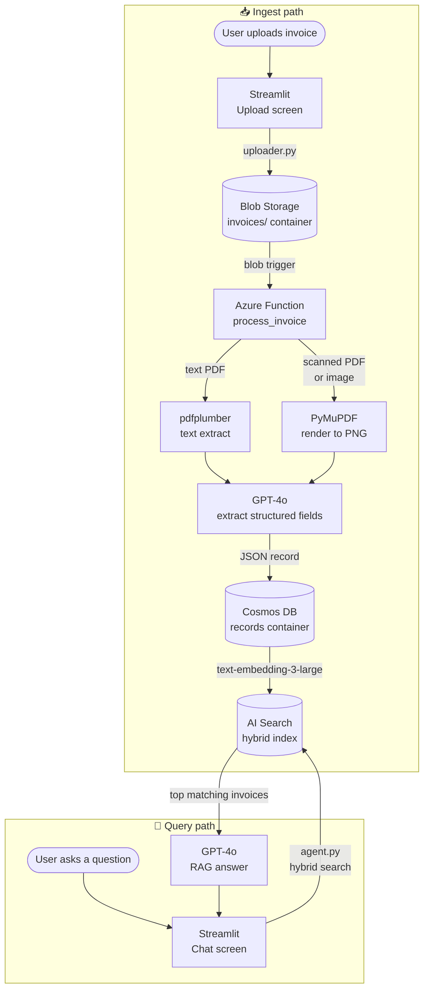

# Invoice Data Extraction & RAG Agent

Extract structured data from invoice documents and chat with your invoice data in plain English.

Built for a home assignment. Covers both the mandatory extraction pipeline and the optional conversational RAG agent backed by Azure.

---

## What it does

| Mode | How it works |
|---|---|
| **Local extraction (Part 1)** | Point `extractor.py` at a folder of invoices → get a CSV. No cloud needed. |
| **Azure RAG agent (Part 2)** | Upload invoices through a web UI → Azure processes them → chat with your data. |

---

## Invoice flow



---

## Tech stack

| Layer | Technology |
|---|---|
| **LLM** | Azure OpenAI — GPT-4o (extraction + chat) |
| **Embeddings** | Azure OpenAI — `text-embedding-3-large` (3 072 dims) |
| **Search** | Azure AI Search — hybrid keyword + vector index |
| **Database** | Azure Cosmos DB — structured invoice records |
| **File storage** | Azure Blob Storage — raw invoice files |
| **Serverless** | Azure Functions (Python v2, consumption plan) |
| **Infrastructure** | OpenTofu (Terraform-compatible) |
| **Frontend** | Streamlit — upload screen, chat screen, admin panel |
| **Auth** | `DefaultAzureCredential` — no secrets stored anywhere |
| **PDF (text)** | pdfplumber |
| **PDF (vision)** | PyMuPDF (fitz) |
| **Images** | Pillow |
| **Runtime** | Python 3.10+ |

### Python dependencies

```
# Core
openai                   GPT-4o API + embeddings
streamlit                browser UI
pdfplumber               text extraction from text-based PDFs
PyMuPDF (fitz)           rendering scanned PDFs to images
Pillow                   image normalisation
pandas                   CSV export (local pipeline)
python-dotenv            load .env config

# Azure SDK
azure-identity           DefaultAzureCredential / AAD auth
azure-storage-blob       direct blob upload from the UI
azure-cosmos             Cosmos DB client (sync + rebuild)
azure-search-documents   hybrid search + index management
```

System dependency for the local pipeline's scanned-PDF path:

```bash
brew install poppler          # macOS
sudo apt-get install poppler-utils   # Ubuntu / Debian
```

---

## Repository layout

```
invoice-agent/
├── app.py                  Home screen — launch pad + admin panel
├── pages/
│   ├── 1_Upload.py         Upload invoices, poll for results, download CSV
│   └── 2_Chat.py           Chat with the RAG agent
├── agent.py                RAG agent — AI Search retrieval + GPT-4o
├── uploader.py             Upload a file to Azure Blob Storage
├── sync.py                 Admin ops — rebuild index, clear all, export CSV
├── extractor.py            Local extraction pipeline (Part 1)
├── store.py                Legacy CSV → SQLite loader (Phase 1 reference)
├── function_app/
│   ├── function_app.py     Azure Function entry points (blob trigger + change feed)
│   ├── extraction.py       GPT-4o extraction logic (text + vision)
│   ├── cosmos_writer.py    Cosmos DB upsert / soft-delete helpers
│   ├── search_indexer.py   AI Search index management + document push
│   └── requirements.txt    Function App dependencies (deployed with the function)
├── infra/                  OpenTofu — all Azure resources
├── scripts/
│   └── rebuild_search_index.py   CLI wrapper for sync.rebuild()
├── tests/                  Unit tests — RAG agent
├── launch.command          macOS double-click launcher
├── requirements.txt        App dependencies
├── requirements-dev.txt    + pytest
└── .env.sample             Copy to .env and fill in endpoints
```

---

## Part 1 — Local extraction

`extractor.py` processes a folder of invoices with GPT-4o and writes a CSV. No Azure infrastructure required — just an OpenAI API key.

### How it picks an extraction strategy

| File | Detection | Strategy |
|---|---|---|
| Text PDF | ≥ 200 extractable chars | pdfplumber → GPT-4o text prompt |
| Scanned PDF | < 200 extractable chars | PyMuPDF renders pages → GPT-4o Vision |
| Image (PNG / JPG / …) | file extension | GPT-4o Vision directly |

### Setup

```bash
# 1. System dependency (only for scanned PDFs)
brew install poppler          # macOS
sudo apt-get install poppler-utils   # Ubuntu

# 2. Python dependencies
pip install -r requirements.txt

# 3. Set your API provider — one of:
export OPENAI_API_KEY=sk-...

# OR Azure OpenAI
export AZURE_OPENAI_ENDPOINT=https://your-resource.openai.azure.com/
export AZURE_OPENAI_API_KEY=your-azure-key
export AZURE_OPENAI_DEPLOYMENT=gpt-4o
export AZURE_OPENAI_API_VERSION=2024-12-01-preview
```

### Run

```bash
python extractor.py ./invoices
python extractor.py ./invoices --output results.csv   # custom output name
```

### Output CSV columns

| Column | Description |
|---|---|
| `file` | Source filename |
| `method` | Extraction strategy (`text+gpt4o` or `vision+gpt4o`) |
| `invoice_number` | Invoice reference number |
| `invoice_date` | Date issued (ISO 8601 where possible) |
| `supplier_name` | Issuing company / person |
| `supplier_name_en` | English translation or romanisation of supplier name |
| `buyer_name` | Billed party |
| `buyer_name_en` | English translation or romanisation of buyer name |
| `total_amount` | Final payable amount (float) |
| `currency` | ISO 3-letter code or symbol |
| `subtotal` | Amount before tax |
| `tax_amount` | Tax total |
| `tax_rate` | Tax percentage |
| `due_date` | Payment due date |
| `po_number` | Purchase order number |
| `payment_terms` | e.g. "Net 30" |
| `line_items` | JSON array of line items |
| `error` | Error message if extraction failed |

---

## Part 2 — Azure backend + RAG agent

Invoices uploaded through the web UI are processed automatically and become queryable through a chat agent.

### Prerequisites

- [Azure CLI](https://docs.microsoft.com/cli/azure/install-azure-cli) — `az login`
- [OpenTofu](https://opentofu.org/docs/intro/install/) — infrastructure provisioning
- [Azure Functions Core Tools](https://docs.microsoft.com/azure/azure-functions/functions-run-local) — `func`
- Python 3.10+

### Step 1 — Provision Azure infrastructure

```bash
cd infra
tofu init
tofu plan
tofu apply
```

This creates: Resource Group, Storage Account, Azure OpenAI (GPT-4o + embeddings), Cosmos DB, AI Search, and a Function App. All resource-to-resource calls use managed identity — no keys are stored.

Note the outputs when done:

```bash
tofu output
```

### Step 2 — Configure the app

```bash
cp .env.sample .env
```

Fill in `.env` with values from `tofu output`:

```env
AZURE_OPENAI_ENDPOINT=https://...
AZURE_OPENAI_API_VERSION=2024-12-01-preview
AZURE_OPENAI_GPT_DEPLOYMENT=gpt-4o
AZURE_OPENAI_EMBEDDING_DEPLOYMENT=text-embedding-3-large
STORAGE_ACCOUNT_NAME=...
COSMOS_ENDPOINT=https://...
COSMOS_DATABASE=invoices
COSMOS_CONTAINER=records
SEARCH_ENDPOINT=https://...
SEARCH_INDEX=invoices
```

### Step 3 — Deploy the Azure Function

```bash
cd function_app
func azure functionapp publish <function_app_name>
```

Replace `<function_app_name>` with the name from `tofu output`.

### Step 4 — Install Python dependencies

```bash
pip install -r requirements.txt
```

### Step 5 — Run the app

**macOS — double-click launcher**

Right-click `launch.command` → Open (first time only, to clear Gatekeeper). Double-click it anytime after that — Streamlit starts and the browser opens automatically.

**Terminal**

```bash
az login          # authenticate with Azure
streamlit run app.py
```

Open [http://localhost:8501](http://localhost:8501).

### App screens

| Screen | What it does |
|---|---|
| **Home** | Launch pad + invoice count + admin panel (sync, export CSV, clear all) |
| **Upload Invoices** | Select PDFs or images, upload to Azure, watch extraction results live, download CSV |
| **Chat with Agent** | Ask questions about indexed invoices in plain English |

### Tests

```bash
pip install -r requirements-dev.txt
pytest tests/                   # RAG agent unit tests
pytest function_app/tests/      # Function App ingestion tests
```

---

## Design decisions

**Extraction**

- **Auto-detected strategy** — text PDF, scanned PDF, and image are detected at runtime so the user doesn't need to pre-sort files.
- **GPT-4o for every path** — one model handles both text understanding and OCR + vision, avoiding two separate ML stacks.
- **`response_format: json_object`** — forces valid JSON output; no fragile regex cleanup.
- **`temperature=0`** — deterministic, repeatable extraction.
- **`MAX_VISION_PAGES = 4`** — caps Vision API cost on multi-page documents.

**RAG agent**

- **Hybrid retrieval** — keyword + vector search so vague questions still find the right records.
- **Top-k = 50** — retrieves enough records for GPT-4o to compute aggregates (totals, averages, rankings) in-prompt at demo scale.
- **Managed identity / Entra ID auth** — no secrets stored; access is controlled through Azure RBAC and scales to a hosted deployment without code changes.
- **Cosmos DB Change Feed** — Azure Function listens for changes and keeps the AI Search index in sync automatically (soft-deletes propagate to Search).
